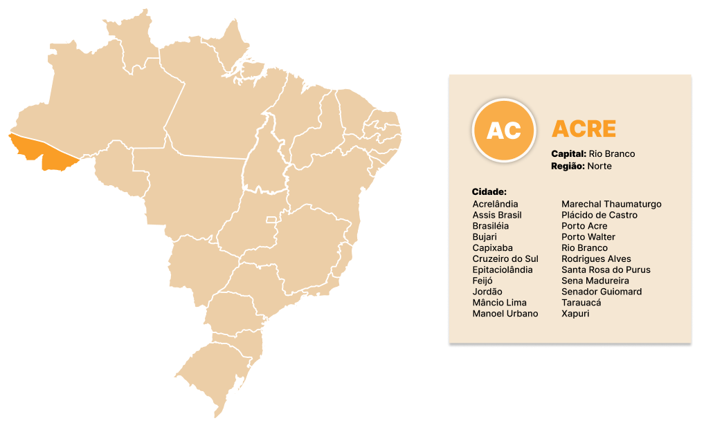

# ATIVIDADE - MAPA

---
### Objetivo:
 Ao selecionar qualquer estado do mapa é necessário que apareça a sigla, o estado, a região e as cidades correspondentes, para obter as informações o aluno deve utilizar API de um outro projeto.

---
### Autor:
- [Genivania Macedo ](https://github.com/Genivania)

---
### Professor: 
- [Fernando Leonid](https://github.com/fernandoleonid)
